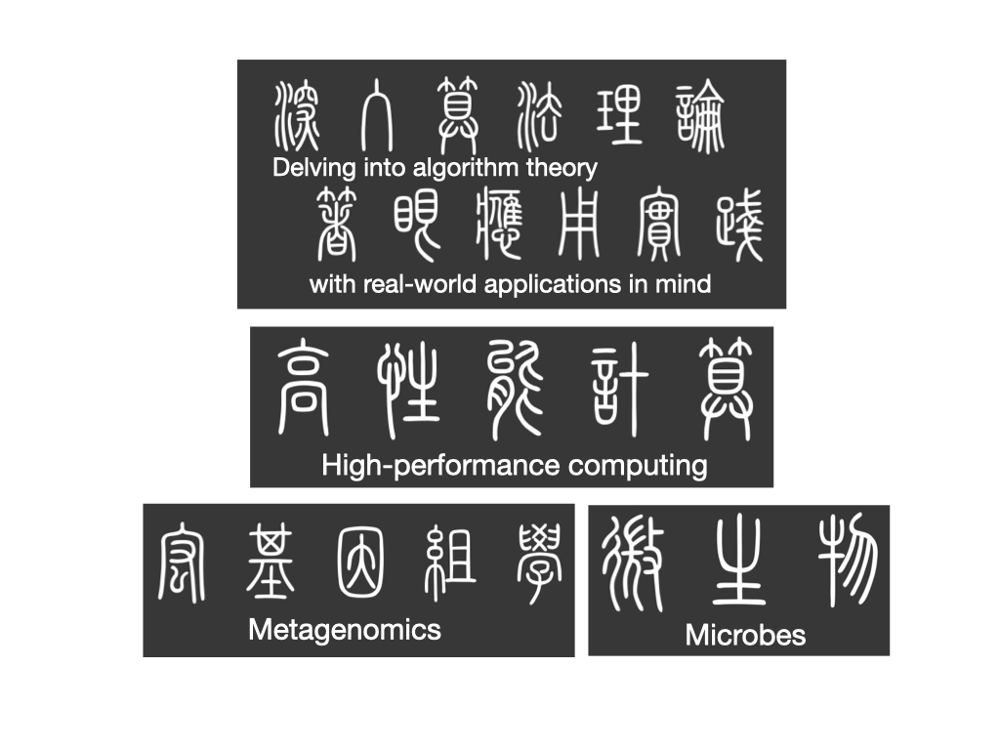

## About me 
Hi there👋. My name is Jianshu (canonically pronounced as Jyen-shoo) Zhao, a computational microbiologist at University of California, San Diego. My primary research interest is microbiome, microbial genomics, genomics, metagenomics and high performance computing. I am a Rustacean :crab:. I am the main developer of several software packages such as [GSearch](https://academic.oup.com/nar/article/52/16/e74/7714450), [annembed](https://academic.oup.com/nargab/article/6/4/lqae172/7928174), [BinDash 2](https://www.biorxiv.org/content/10.1101/2024.03.13.584875v1.abstract) and [graphembed](https://www.biorxiv.org/content/10.1101/2025.06.18.660497v1.abstract). More information about me [here](https://jianshu93.github.io/blog/about/). Contact me with jianshuzhao at yahoo.com

  

I am a fan of Rust. Go Ferris!

  

<!--
**jianshu93/jianshu93** is a ✨ _special_ ✨ repository because its `README.md` (this file) appears on your GitHub profile.

Here are some ideas to get you started:

- 🔭 I’m currently working on ...
- 🌱 I’m currently learning ...
- 👯 I’m looking to collaborate on ...
- 🤔 I’m looking for help with ...
- 💬 Ask me about ...
- 📫 How to reach me: ...
- 😄 Pronouns: ...
- ⚡ Fun fact: ...
-->
